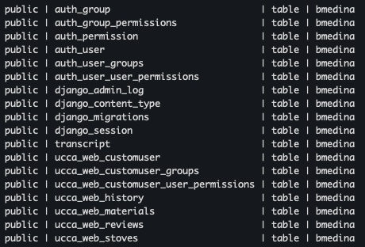
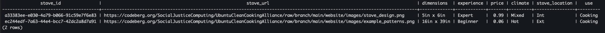

# Final Project 2025 

I created a Django application that stores a users login information as well as adds to a database when a user is registered. My application also allows for a super user to add, edit, and delete stoves which a python script renders on my forms page in a table.

### ER Diagram 

#### What I changed:
- I added more enumerations, as manny items in stoves (like climate and use) needed to be limited to specific options to make querying the database easier
- I used Djangos automated model for users and added an extra permission tag for users based on the fact if they were admin and what page they could view
- Instead of unique, I used UUID which was a Unique ID field that pretty much put a bundch of different characters and symbols as the id
- I used more Django relavent data types 

#### What I would change now
- I would have left out the UUID and just done an auto increment ID

### My "SQL" Script

Because I used django my 'sql' script was actually python in a file called [models.py](https://github.com/1bMedina/ucca/blob/main/final_project/ucca_web/models.py) which is linked. Even though it is python, it does the same thing. Within my settings.py of my application, i connected our schools database so when i migrated my models.py it would create tables there. 

This is what the tables look like in our server: 

this image is of stoves i created in the sites admin page that was automatically added to the database

### Python Scripyt That Extracts From The Database

    def form(request):
        all_stoves = Stoves.objects.all

    return render(request, 'ucca_web/form.html', {'all_stoves': all_stoves})

This code creates a function called form that takes an HTTP request as an argument. This means the function will be called when the user maps to it. Stoves.objects.all is an ORM query to recieve all rows from the stoves model. Then, it returns an HTML template (form.html) with the data. The last part passes the all_stoves queryset to the template under the name all_stoves.

    <table class="container table table-striped table-hover">
    <thead>
        <tr>

        <th scope="col">URL</th>
        <th scope="col">Experience</th>
        <th scope="col">Location</th>
        <th scope="col">Use</th>
        </tr>
    </thead>
    <tbody>
        
    <tr>
      <td>{{ obj.stove_url}}</td>
      <td>{{ obj.experience }}</td>
      <td>{{ obj.stove_location }}</td>
      <td>{{ obj.use }}</td>
    </tr>
    
    </tbody>
    </table>

- The first section of the table renders a header to the table which explains what each column will contain.
- The second part interates through all_stoves and assigns each value to obj.
- Then you assign each "header" a value.
- This will all be added to and immediatly updated anytime a new stove is added within the admin page.

### Excel 

- A link to my excel: [here](https://apsva-my.sharepoint.com/:x:/r/personal/1017543_apsva_us/Documents/output.xlsx?d=w925ee36875094788b4017f3ef612212d&csf=1&web=1&e=8C4FXc)

